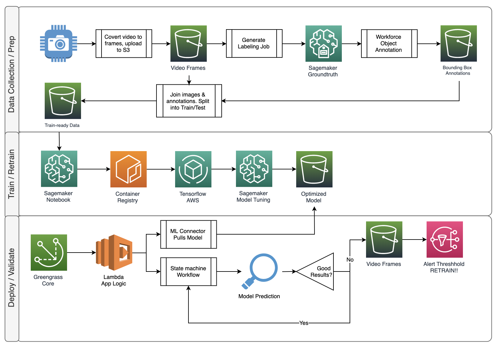

# CV/ML Toolkit for Self Guided Object Detection with Tensorflow, Sagemaker, and Sagemaker Groundtruth.

This material strives to provide a comprehensive set of notebooks to showcase a standard ML Object detection workflow. The workflow is being leveraged as part of a larger foundational CV/ML framework. This repo was forked from Angela Wang's original work but substantially modified to account for (among other things) a custom Tensorflow image, model optimization through Hyperparameter tuning jobs, and model inference. The conclusion of the excercise produces model artifacts that can be consumed by your application. 

**Object detection** is the process of identifying and localizing objects in an image. A typical object detection solution takes in an image as input and provides a bounding box on the image where an object of interest is, along with identifying what object the box encapsulates.

### CV/ML Toolkit Objectives:
* Data collection/procurement by way of capturing static frames from video.
* Curating a good data-set to prepare for labeling
* Dataset labeling techniques with Amazon Sagemaker Groundtruth.
* Launching a custom tensorflow container in your account
* Training against that container with a base model of your choice.
* Running Model tuning jobs to optimize your model across a given range of optimizations.
* Testing the accuracy of your model on new images.
* Export your model for use in your application.

### For best results, to get started:
1. Log into your AWS Console, select Sagemaker.
1. Create a new notebook instance (or launch an existing one).
1. Once the notebook instance has loaded, select __"Open Jupyter"__ to get into the Jupyter console.
1. From the console, select __New__ (upper right) and then __Terminal__.
1. Once the terminal window loads:

```
sh-4.2$ cd SageMaker
sh-4.2$ git clone git@github.com:RaleighSF/amazon-sagemaker-aws-greengrass-custom-object-detection-model.git
```
6. Now go back to the Jupyter console (or click on the Jupyter logo upper left).
7. Click into the __amazon-sagemaker-aws-greengrass-custom-object-detection-model__ directory.
8. Finally, launch the __CVML_Toolkit.ipynb__


## Architecture 


## Sections


## License Summary

This sample code is made available under the MIT-0 license. See the LICENSE file.
